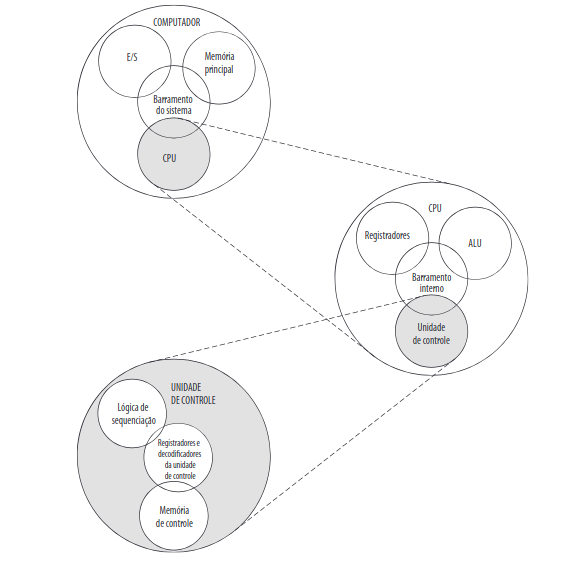
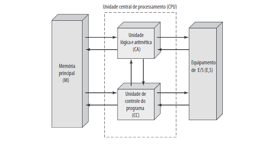
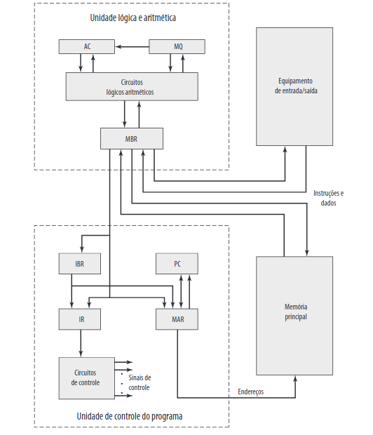
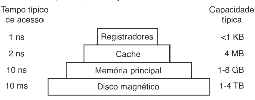
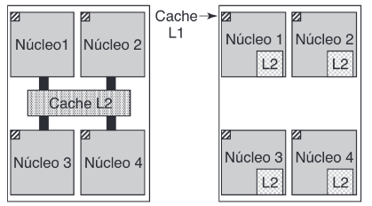
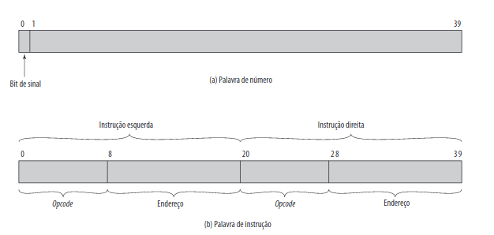
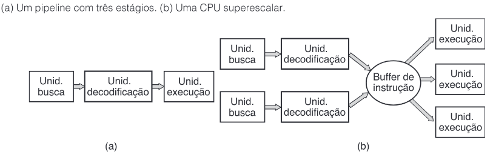

# Organização e Arquitetura de Computadores

Computador Definição: Máquina que executa algoritmos para gerar algum resultado.

Arquitetura: Visíveis ao programador, impacto direto na execução lógica.

Organização: Unidades operacionais e suas interconexoções.

*(Família de computadores -> Arquitetura Igual - Organização Diferente)*

**Funcional**
1. Processamento de dados
2. Armazenamento de dados
3. Movimentção de dados
4. Controle

**Estrutural**
1. CPU (Central Processing Unit)
2. Memory
3. I/O (Input/Output)
4. BUS

**Máquina de Van Neumann**

*Programa Armazenado*
* Memória principal armazena dados e instruções
* Possui ALU para operar dados binários
* Possui CU que interpreta instruções na memória e as executa.
* I/O operadas pela CU

**CPU**
1. CU (Control Unit)
2. ALU (Arithmetic Logic Unit)
3. Register
4. Barramentos

**Processador**
* MBR (Memory Buffer Register)
* MAR (Memory Address Register)
* IR (Instruction Register)
* IBR (Instruction Buffer Register)
* PC (Programm Counter)
* AC (Acumulator)
* MQ (Multiplier Quotient)

**Memória**
1. Registrador
2. Memória Cache (L1, L2, L3)
3. Memória Principal
   * Memória RAM (Random Access Memory) - DRAM - SRAM
   * Memória ROM (Read Only Memory) - BIOS (Basci Input and Output System), SETUP, POST (Power On Self Test)
4. Memória Secundária
   * HD (Hard Disk)
   * SSD (Solid-State Drive)
   * CD/DVD
   * Pen-Drive

**Barramento**
* Barramento de Dados
* Barramento de Endereço
* Barramento de Controle

**Dispositivos I/O**
1. Entrada
   * Teclado
   * Mouse
   * Microfone
   * Câmera
2. Saída
   * Monitor
   * Fone
   * Impressora
3. Híbrido
   * Headset
   * Multifuncional
   * Tela TouchScreen

**Arquiteture de Processadores**
* CISC (Complex Instruction Set Computing)
 *Exemplo: Intel x86*
* RISC (Reduced Instruction Set Computing)
 *Exemplo: ARM*

**Memória IAS**
* Palavra (Exemplo: 40 bits)
   * Palavra de número: 1 bit de sinal + 39 bit valor
   * Palavra de intrução: 2 instruções de 20 bits (8 bits opcode + 12 bits endereço)

**Instrução**
* Palavra = opcode + operando
* Instrução = Busa (Fecth Cycle ) + Decodificação + Execução (Execution Cycle)
* Instrução != Ciclo

(Alguns microcontroladores executam um ciclo de instrução a cada 4 ciclos de clock.)

**Clock**

Comanda o ciclo através do pulso do clock.

Hz ou Ciclos/s

1 GHz = 1 bilhão de pulsos por segundo.

**MIPS**

*Millions of Instructions Per Second*

Medida de velocidade de processadores.

**Técnicas de Processamento**

* Pipeline = Várias intruções ao mesmo tempo

*Paralelismo*
* Superescalar = Várias pipelines ao mesmo tempo

**Linha do Tempo**

1. Válvulas
2. Transistores
3. Circuitos Integrados
4. Microprocessadores (Multicore) e Memórias Semicondutoras 
5. Técnicas de Processamento

*Author: Brendo Oliveira - 
Images: Computer Organization and Architecture - William Stalling + Modern Operating System - Andrew Tanenbaum*

