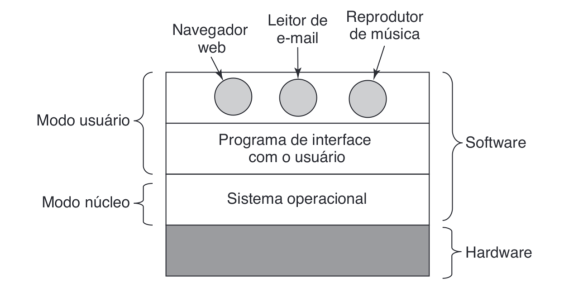
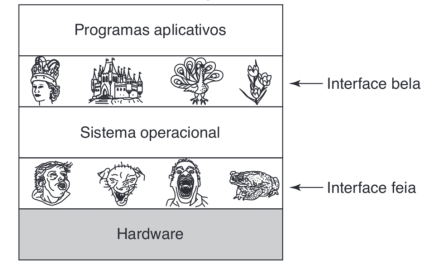
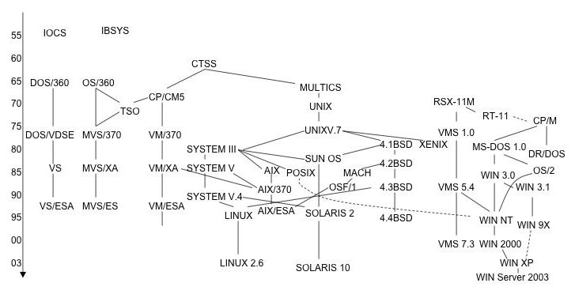
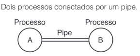
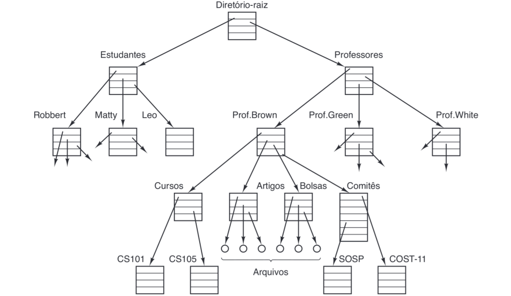
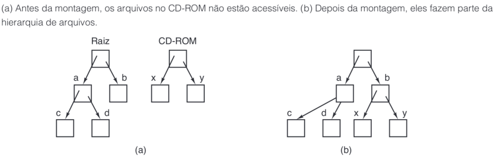
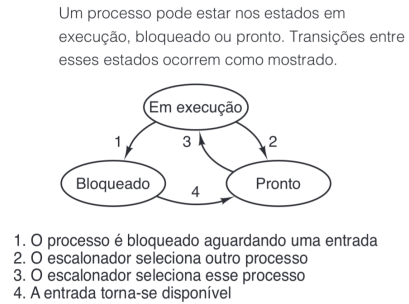
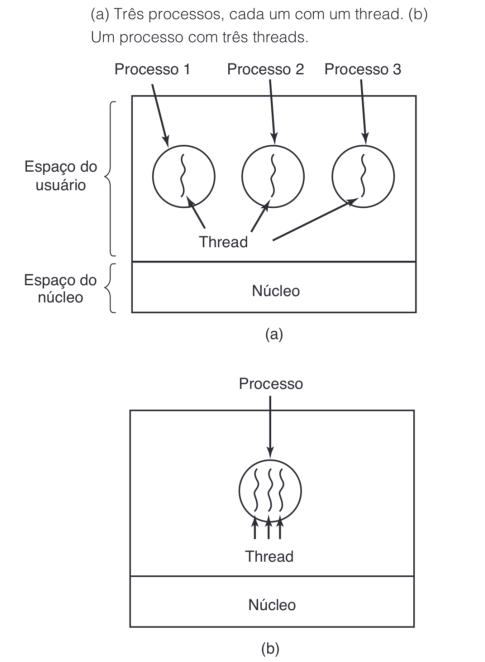

# Sistema Operacional

Hardware <- Sistema Operacional -> Software

**Divisão**
1. Modo Usuário
2. Modo Núcleo (Supervisor)

**Funções**
1. Abstração
2. Gerenciamento

**Softwares**
1. Sistema
  * OS.
  * Controladores de Dispositivos (Drivers)
2. Utilitários
  * Compilador
  * Linker
  * Loader
  * Debbuger
  * Interpretador
  * Tradutor
3. Aplicativos
  * Editor de Texto
  * Reprodutor de Música
  * Exibidor de Imagem

**Interação**
1. GUI (Graphical User Interface)
2. CLI (Comand Line Interface) - Shell

**Sistemas Principais**
1. CTSS (Compatible Time Sharing System)
2. MULTICS (Multiplexed Information and Computer Service)
3. UNIX
   *POSIX (Portable Operate System Interface)*
5. MINIX
6. Linux

**Sistemas em Discos**
1. CP/M (Control Program for Microcomputers)
2. DOS (Disk Operating System)
3. XENIX -> UNIX (Microsoft)
4. Lisa (Apple)
5. Macintosh (Apple)
6. MS-DOS (Microsfot)

**Tipos**
* Monotarefa (Monoprogramável)
* Multitarefa (Multiprogramável)

 *Timesharing*
* Multiprocessadores

**Modo**
* Monousuário
* Multiusuário

**Conceitos**
1. Processo (*Process*)
  * Processo Filho -> Árvore de Processos
  * Comunicação entre Processos
  * UID (User Identification)
  * GID (Group Identification)
  * PID (Process Identification)
  * Pipe
 

2. Espaços de Endereçamento

3. Arquivos
  * Sistema de Arquivos
  * Diretório
  * Permissão
  * Monstagem de Sistemas de Arquivos

**Chamada de Sistema**

*System Call*

Processo -> Chamada -> Núcleo -> Chamada -> Processo

**Processo**

Programa em execução

* Criar
* Apagar
* Ler
* Escrever
* Abrir
* Fechar

**Threads**

* Menor unidade que pode ser processada
* 1 Processo = N Threads

**Escalonamento**

Preferêmcia de execução de processos ou threads

**Arquitetura do Kernel**

*Kernel = Núcleo*

* Monolítico
* Sistema de Camadas
* Micronúcleo
* Sistema Cliente-Servidor
* Máquinas Virtuais
* Exonúcleos

*Author: Brendo Oliveira - Images: Modern Operating System - Andrew Tanenbaum*
