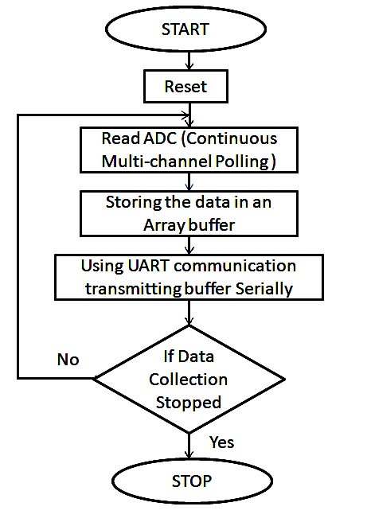

# Lógica de Programação

**Abordagem**
* Fluxograma
* Pseudocódigo
* Linguagem de Programação

**Algoritmos**
 
**-Início**

**Variáveis**
* Tipo
* Nome (Identificador)
*(Local, Global)*
* Valor (Atribuição)

    * Início Letra
    * Alfanumérico
    * Não Espaço
    * Não Símbolo
    * Não Assento
    * Não Reservado

**Comandos de Entrada**

**Comandos de Saída**

**Operadores**
* Aritmético
* Relacional
* Lógico

**Estruturas**
* Condição
* Repetição

**Rotinas**
* Procedimento
* Função

**Vetores**
1. Unidimensionais
2. Bidimensionais

**-Fim**

**Operadores Aritméticos**
 * Adição
 * Subtração
 * Divisão
 * Multiplicação
 * Exponenciação
 * Módulo
 *(Ordem de Precedência)*

**Operadores Relacionais**
 * Igual
 * Maior
 * Maior Igual
 * Menor
 * Menor Igual
 * Diferente

**Operadores Lógicos**
* AND
* OR
* NOT
 *(Ordem de Precedência)*

**Estrutura de Condição**
* Se - Senão
   * Simples
*(Bloco 1)*
   * Composta
*(Bloco 1 ..N)*
* Escolha - Caso

**Estrutura de Repetição**

* Enquanto
* Repita
* Para

**Passagem de Parâmetros**
* Valor
* Referência

**Práticas**
* Indentar
* Aninhar
